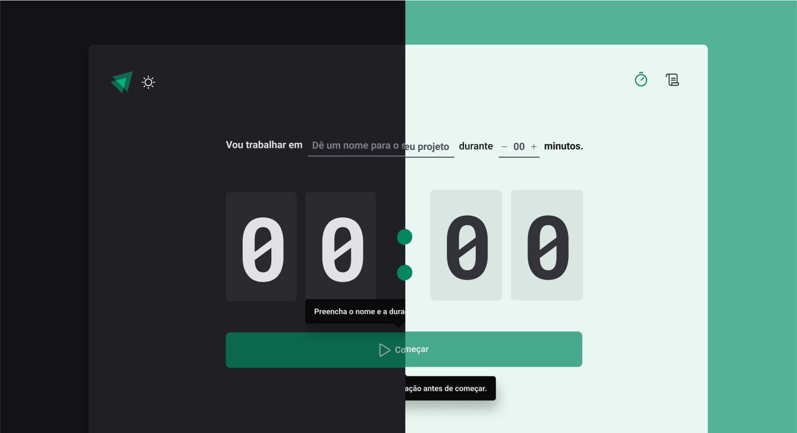

<h1 align="center"> Gtimer </h1>

Project for chapter 2 of the Ignite-Rocketseat certification fundamentals module.

  <a href="#-tecnologias">Tecnologys</a>&nbsp;&nbsp;&nbsp;|&nbsp;&nbsp;&nbsp;
  <a href="#-projeto">Project</a>&nbsp;&nbsp;&nbsp;|&nbsp;&nbsp;&nbsp;
  <a href="#-layout">Layout</a>&nbsp;&nbsp;&nbsp;|&nbsp;&nbsp;&nbsp;
  <a href="#memo-licença">License</a>

  

 

  

## 🚀 Tecnologys

This project was developed with the following technologies:

- [ReactJS](https://https://react.dev/)
- [Typescript](https://www.typescriptlang.org/)
- [Vite](https://vitejs.dev/)
- [Styled Components](https://styled-components.com/)
- [React Router](https://reactrouter.com/)

## 💻 Project

Gtimer is a web page for using the pomodoro technique with control of activities carried out.

## 🔖 Layout

You can view the project layout through [THIS LINK](<https://www.figma.com/design/kByLuZygTc0OwWBq5Hfoq6/Ignite-Timer-(My)?node-id=11-599&t=nBKecR9vBW5zwWbv-0/duplicate>). You must have a [Figma](https://figma.com) account to access it.

## :memo: License

This project is under the MIT license.

---

Made with ♥ by me together with Rocketseat
